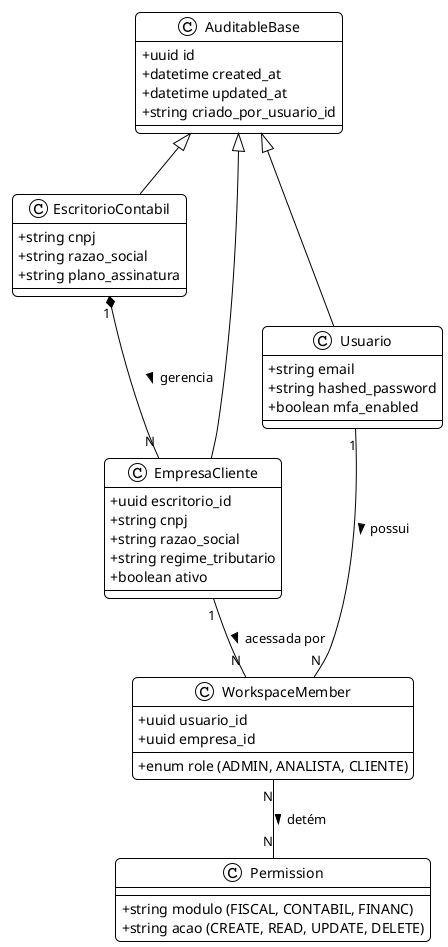
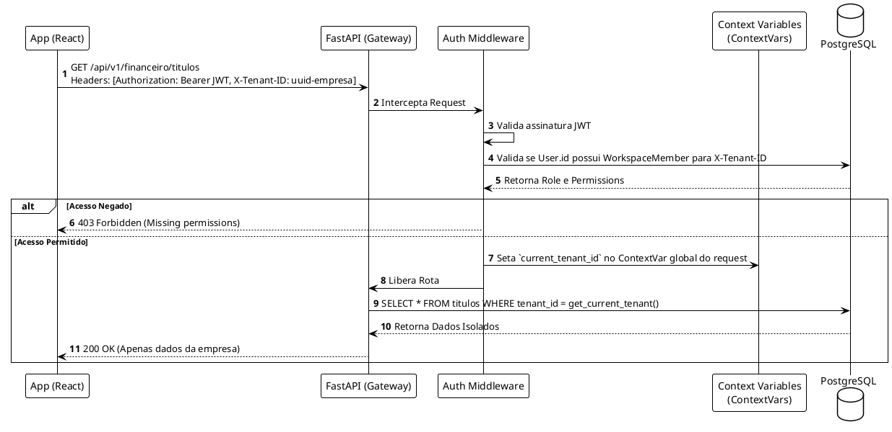

# 🏛️ 01 - Visão Arquitetural e Core (Base do ERP)

## 1. Contexto e Escopo
O módulo **Core e Fundação** é a espinha dorsal de segurança e orquestração do ERP. Ele garante que um escritório de contabilidade possa gerenciar centenas de empresas sem o risco de contaminação cruzada de dados. Baseado em **FastAPI, PostgreSQL e SQLAlchemy**, este módulo implementa Multi-tenancy (por isolamento de linha - Row Level Security lógico) e Controle de Acesso Baseado em Atributos e Papéis (RBAC).

---

## 2. Diagrama de Classes e Entidades Core (PlantUML)

O modelo abaixo detalha as entidades fundamentais do sistema. A separação entre `EscritorioContabil` (Super Tenant) e `EmpresaCliente` (Tenant) é vital para o B2B2B.



---

## 3. Dinâmica de Autenticação e Roteamento Seguro

Para garantir o isolamento de dados sem onerar a performance, a arquitetura injeta a validação do `tenant_id` via Middleware e Dependências do FastAPI.

### Fluxo de Validação de Acesso (API Request)


---

## 4. Regras de Negócio e Segurança (Robustez)

1. **ContextVars do Python:** O `tenant_id` extraído do header não é passado manualmente de função em função. Ele é salvo no `contextvars` do Python. Qualquer consulta SQLAlchemy dentro dessa thread injetará o `WHERE tenant_id = context.get()` automaticamente (usando SQLAlchemy events ou base classes).
2. **Rotação de Tokens e MFA:** O módulo Core exige suporte a Multi-Factor Authentication (MFA) obrigatório para papéis de `ADMIN` e `CONTADOR`.
3. **Audit Trail (Log de Auditoria):** Todo acesso POST, PUT ou DELETE gera um registro em uma tabela paralela de logs (ElasticSearch ou PostgreSQL JSON) anotando `usuario_id`, `tenant_id`, `endpoint`, e `payload_modificado`.

---

## 5. Especificação Técnica para Codificação

> [!tip] Estrutura de Diretórios Proposta
> ```text
> backend/app/
> ├── core/
> │   ├── auth.py          # Lógica de JWT, Hash de senha
> │   ├── security.py      # Middlewares de Tenant e validação RBAC
> │   └── database.py      # Configuração do SQLAlchemy com ContextVar injetado
> ├── models/
> │   └── base_tenant.py   # Classe abstrata TenantModelBase herdando AuditableBase
> └── api/routers/
>     └── workspaces.py    # CRUD de Empresas e Associação de Usuários
> ```

### Tabela de Permissões Básicas Iniciais
| Role | Leitura | Escrita | Deleção | Fechamento Contábil |
|---|---|---|---|---|
| **ADMIN (Escritório)** | Tudo | Tudo | Tudo | Permitido |
| **ANALISTA (Escritório)**| Tudo | Módulos Atribuídos | Proibido | Somente Leitura |
| **CLIENTE (Empresa)** | Apenas DRE Gerencial | Apenas Upload Documentos | Proibido | Proibido |

---
*Módulo detalhado para início de implementação de código.*
