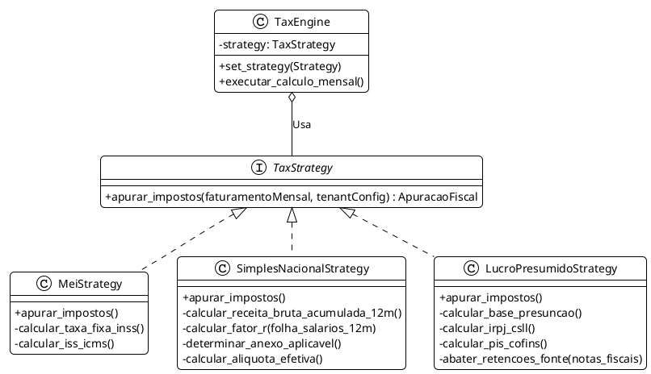

# 📋 02 - Motor Fiscal e Regimes Tributários

## 1. Contexto e Escopo
O **Módulo Fiscal e Tributário** substitui o *TaxPipeline* estático do antigo CEDIPI Shield e generaliza a arquitetura para processar três grandes regimes brasileiros: **MEI, Simples Nacional e Lucro Presumido**. Este módulo recebe notas fiscais de serviço (NFS-e), extrai a receita bruta, aplica as regras tributárias específicas do regime ativo da empresa (`Tenant`) e gera o espelho de impostos a pagar (DAS ou DARFs).

---

## 2. Diagrama de Classes e Strategy Pattern (PlantUML)

A base do desenvolvimento utilizará o padrão de projeto `Strategy`. O motor fiscal não fará `if regime == 'MEI'`, mas sim delegará o cálculo para uma classe especializada, forçando a implementação de uma interface comum.

---

## 3. Regras de Negócio e Fórmulas de Cálculo

Abaixo, o detalhamento matemático que os engenheiros devem programar nos testes unitários (`pytest`).

### 3.1 Simples Nacional (Anexos I a V) e Fator R
A Alíquota Efetiva ($Ae$) do Simples Nacional não é a tabela simples. Ela exige calcular a Receita Bruta Acumulada dos últimos 12 meses ($RBT12$).

* **Fórmula da Alíquota Efetiva:** 
  $$ Ae = \frac{(RBT12 \times \text{Alíquota Nominal}) - \text{Parcela a Deduzir}}{RBT12} $$

* **Fator R (Serviços Anexo III vs V):**
  $$ \text{Fator R} = \frac{\text{Folha de Salários 12m}}{RBT12} $$
  *Se Fator R $\geq$ 28%, tributa no Anexo III (mais barato). Se $<$ 28%, tributa no Anexo V (mais caro).*

### 3.2 Lucro Presumido e Retenções (Herança do CEDIPI)
Para o Lucro Presumido, a tributação é trimestral para IRPJ/CSLL e mensal para PIS/COFINS.

* **Bases de Presunção (Serviços Médicos/Gerais):** 32% (Regra Geral). Pode reduzir para 8% (IRPJ) e 12% (CSLL) se a clínica médica for equiparada a hospital e atender normas da ANVISA.
* **Abatimento de Retenções na Fonte:**
  * O sistema varre todos os XMLs de NFS-e do mês.
  * Captura os campos: `<ValorIssRetido>`, `<ValorIR>`, `<ValorCSLL>`, `<ValorCofins>`, `<ValorPis>`.
  * **Regra Matemática Final:** Valor do DARF = (Faturamento Bruto * Alíquota) - Total de Retenções Sofridas. Se der negativo, o saldo fica como Crédito Tributário.

---

## 4. Tabela de Mapeamento: Perfil de Tomador para Retenção

O motor fiscal herdará o `RetentionProfileMatcher` do CEDIPI. O CNPJ do Tomador do serviço deve ser testado contra este mapeamento:

| Perfil do Tomador (CNPJ) | Reter IRRF (1,5%) | Reter CSRF (4,65%) | Condição para Reter CSRF |
|---|:---:|:---:|---|
| **PJ Lucro Real / Presumido** | SIM | SIM | Pagamento único superior a R$ 215,05 |
| **PJ Simples Nacional** | NÃO | NÃO | Isenção legal para PJs do Simples pagando. |
| **Pessoa Física** | NÃO* | NÃO | *Se o serviço for de PF para PF, aplica-se Carnê Leão. Mas de PJ para PF não há retenção de PF. |
| **Órgãos Públicos Federais** | SIM | SIM | Alíquota conjunta 5,85% ou 9,45% (Lei 10.833). |

---

## 5. Especificação Técnica para Codificação

> [!tip] Entradas e Saídas do Módulo
> **Input (JSON Request):** `competencia: "2026-08"`, `tenant_id: UUID`.
> **Mecânica Interna:** O motor puxa via SQLAlchemy o total das Notas Fiscais, Consulta a Tabela de Configuração Tributária do Tenant, aciona a Estratégia correspondente, calcula, salva a Apuração, e retorna.
> **Output:** Objeto `ApuracaoFiscal` (incluindo todos os valores de impostos devidos detalhadamente em JSON).

- **Scripts Core:** `backend/app/contexts/fiscal_engine/strategies/`
- **Tabelas Fixas no DB (Seed):** Necessário popular as tabelas do PostgreSQL via Alembic com as alíquotas do Simples Nacional de 2026 e faixas de contribuição.
