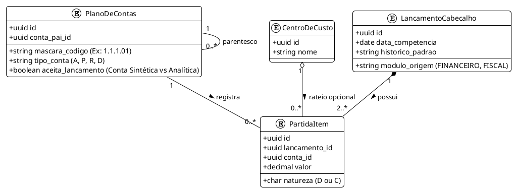

# ⚖️ 03 - Motor Contábil e Partidas Dobradas

## 1. Contexto e Escopo
O **Módulo Contábil** substitui o agrupamento em JSON simplório do antigo "Extrator DRE" por um **Ledger Transacional Rigoroso**. Baseado nos Princípios Fundamentais da Contabilidade, tudo no sistema orbita o Método das Partidas Dobradas, em que não existe exclusão de saldo, apenas lançamentos e estornos. O sistema deve emitir relatórios oficiais, como Livro Diário, Livro Razão, Balancete e Balanço Patrimonial.

---

## 2. Diagrama Entidade-Relacionamento Contábil (PlantUML)

A modelagem de dados contábil precisa ser hierárquica e blindada. O banco de dados exige transações ACID para nunca ter uma "Partida Simples" solta por erro de rede.

---

## 3. Regras de Negócio: Árvore do Plano de Contas

O sistema deve trabalhar com dois conceitos de conta:
1. **Contas Sintéticas (Agrupadoras):** Não recebem lançamentos diretos. O saldo delas é a soma de suas contas filhas. Ex: `1.1 - ATIVO CIRCULANTE`.
2. **Contas Analíticas:** As folhas da árvore. É onde o dinheiro de fato é registrado. Ex: `1.1.1.01 - Banco Itaú C/C`.

### A Equação Fundamental
Toda gravação no banco de dados DEVE passar por um `LedgerController` que levanta uma `Exception` se:
$$ \sum_{i=1}^{n} \text{Valor Débito}_i \neq \sum_{j=1}^{m} \text{Valor Crédito}_j $$

---

## 4. Estruturação do Balanço e DRE (Regime de Competência)

Diferente do Extrator DRE (Caixa), o Balanço por competência reage no momento do fato gerador.

* **Fato Gerador (Emissão da NFS-e de R$ 10.000):**
  * DÉBITO: Clientes a Receber (Ativo) = R$ 10.000
  * CRÉDITO: Receita de Prestação de Serviços (Receita) = R$ 10.000
* **Liquidação (Cliente paga a Nota no Banco):**
  * DÉBITO: Banco Itaú C/C (Ativo) = R$ 10.000
  * CRÉDITO: Clientes a Receber (Ativo) = R$ 10.000

**Geração de Relatórios (Views Materializadas):**
Para garantir alta performance, o Balancete de Verificação (que soma todas as partidas de todas as contas) não fará o cálculo do zero a cada page load. O PostgreSQL usará *Materialized Views* ou tabelas de saldos consolidados mensais (`SaldoContaMensal`).

---

## 5. Especificação Técnica para Codificação

> [!tip] Fechamento e Travamento de Período
> Um dos grandes problemas em sistemas contábeis é lançar dados retroativos e alterar saldos de anos já fechados e declarados no SPED.

- **Locking Contábil:** Criar tabela `PeriodoContabil` com colunas `ano_mes` e `status` (ABERTO / FECHADO).
- O middleware intercepta qualquer gravação em `PartidaItem`. Se `data_competencia` cair em um mês FECHADO, recusa a API (HTTP 400).
- **Integração:** Toda vez que um Título for liquidado no Módulo Financeiro, o sistema despacha um evento interno (`EventBus` ou Celery) que aciona o `LedgerController` para escrever as partidas contábeis. Nunca o Módulo Financeiro deve inserir dados direto na tabela de Partidas (Separação de Contextos/DDD).
