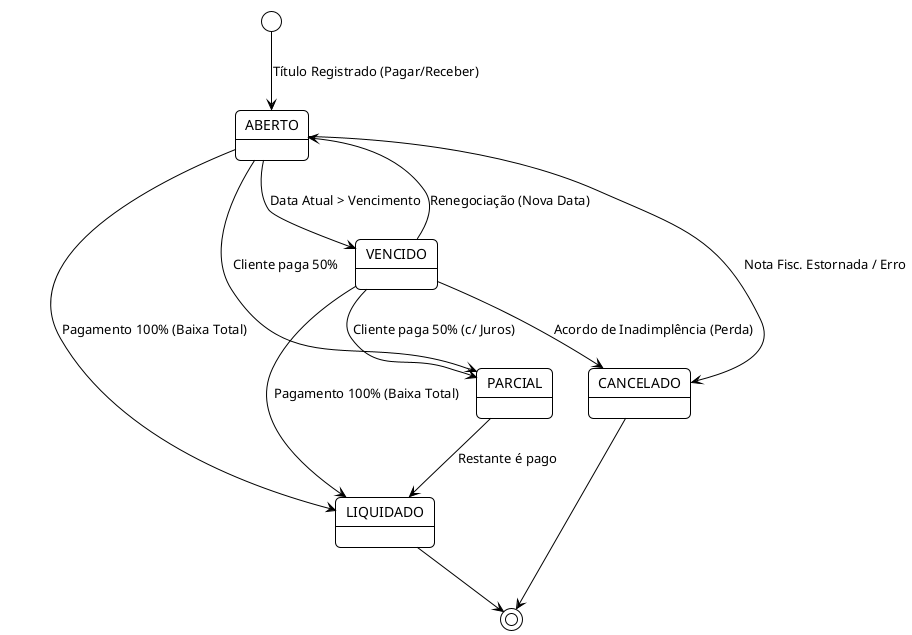

# 💰 04 - Financeiro e Reconciliação (Regime de Caixa)

## 1. Contexto e Escopo
O **Módulo Financeiro** gerencia o fluxo de dinheiro no tempo. Herdeiro das funções do "Extrator DRE" (Planilhas de Caixa) e do Motor de Reconciliação do CEDIPI Shield (Cartões de Crédito), este módulo suporta BPO Financeiro avançado: gestão de Contas a Pagar/Receber, tesouraria, fluxo de caixa projetado e um rigoroso Motor de Conciliação Bancária. 

Aqui vive o **Regime de Caixa** (o DRE Gerencial).

---

## 2. Diagrama de Estados do Título Financeiro (PlantUML)

Para rastrear faturas, boletos e contas, modelamos o Título Financeiro com uma máquina de estados robusta que prevê pagamentos parciais e abatimentos.

---

## 3. Motor de Conciliação Bancária (O "Match")

A conciliação é a automação que amarra o banco de dados interno com a realidade do Banco (Extrato bancário).

### 3.1. Ingestão de Transações
1. **OFX / Planilhas (Legado):** O usuário faz upload, a `Staging API` transforma as linhas em tabela `TransacoesPendentes`.
2. **Open Finance (Novo):** Integração contínua (ex: APIs Pluggy, Belvo ou BACEN) traz o extrato automaticamente toda madrugada via Webhooks, sem intervenção humana.

### 3.2. Lógica Algorítmica (Reconciliation Engine)
O motor do CEDIPI que encontrava pagamentos de cartão de crédito atrasados foi expandido.

* **Fase 1 (Match Exato):** Procura Título que bata com o Extrato usando as chaves `Valor Exato` + `CNPJ/CPF`.
* **Fase 2 (Fuzzy / Levenshtein Match):** Caso de PIX ou Ted sem CNPJ no extrato. A string do extrato (Ex: `PIX TRANSF JOAO DA SILVA`) é comparada com a string do Favorecido (`João Silva Lanchonete`) no Contas a Pagar. Se a *Levenshtein Distance* for > 85% e o valor bater, o match é sugerido.
* **Fase 3 (Tolerância D+N):** Pagamentos de maquininha de cartão costumam cair 1 a 2 dias depois, muitas vezes com taxa descontada. O motor varre um *range* de data (`Vencimento + 3 dias`) e aprova liquidações com variação de valor, criando automaticamente a contrapartida de "Despesa Bancária / Taxa de Cartão".

---

## 4. O DRE Gerencial (Fluxo de Caixa)

Ao contrário do DRE Contábil (Módulo 03) que usa o Plano de Contas Oficial do Governo e baseia-se em competência, o **DRE Gerencial do Extrator** baseia-se exclusivamente em dinheiro que pingou na conta.

* O usuário agrupa Centros de Custos e Categorias Gerenciais (ex: "Publicidade Insta", "Comissão Vendedores") em painéis (Dashboards) React.
* Esse DRE não cruza com a contabilidade fiscal oficial; é o termômetro de saúde financeira para o dono da empresa.

---

## 5. Especificação Técnica para Codificação

> [!tip] Relação com a Contabilidade
> **NUNCA** uma rotina financeira salva dados direto na tabela Contábil.

1. **Mensageria Limpa:** Quando o motor de conciliação marca um Título como `LIQUIDADO`, ele publica uma mensagem em um Message Broker (RabbitMQ ou Celery `Task`).
2. O serviço de Contabilidade capta essa mensagem e gera a Partida Dobrada (Débito e Crédito) internamente. Isso preserva as fronteiras do *Domain Driven Design (DDD)*.
3. As APIs devem fornecer *paginação avançada* (Pydantic / FastAPI pagination) e filtro temporal para os painéis de Fluxo de Caixa Projetado (títulos Abertos no futuro).
