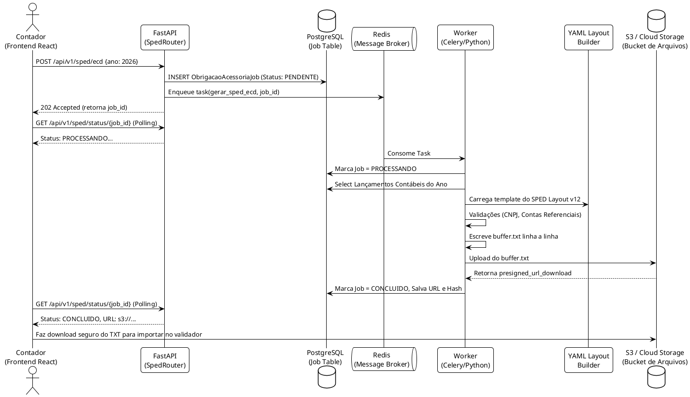

# 🔗 05 - Obrigações Acessórias e SPED

## 1. Contexto e Escopo
A coroa de um sistema contábil maduro é proteger o usuário da malha fina gerando **Obrigações Acessórias governamentais perfeitas**. O Módulo de Obrigações não cria informações novas, mas extrai a vasta massa de dados do *Motor Fiscal (Módulo 02)* e do *Motor Contábil (Módulo 03)* para formatar as declarações.

Os alvos primários do ERP são:
* **DEFIS / PGDAS-D:** Simples Nacional.
* **SPED ECD:** Escrituração Contábil Digital (Livro Diário).
* **SPED ECF:** Escrituração Contábil Fiscal (Apuração do IRPJ/CSLL).
* **e-Social / REINF:** Integrações de folha e retenções previdenciárias.

---

## 2. Diagrama da Arquitetura Assíncrona (PlantUML)

Processar um SPED para um cliente com 200.000 lançamentos no ano consome GBs de RAM e travaria a API do FastAPI (Timeout). O design emprega **Background Jobs (Workers)**.



---

## 3. O Padrão "Layout Builder" Dinâmico (YAML)

A Receita Federal altera os layouts do SPED periodicamente. Para evitar refatoração massiva de classes Python a cada ano, adotamos um "Motor de Layouts". O ERP lê gabaritos `.yaml` que definem a posição e tipo de dado de cada campo do TXT.

*Exemplo de Mapeamento do Bloco I200 (Lançamento Contábil):*
```yaml
# layouts/sped_ecd_v12.yaml
blocos:
  I:
    I200:
      descricao: "Lançamento Contábil"
      campos:
        1: { nome: REG, tipo: STR, tamanho: 4, fixo: "I200" }
        2: { nome: NUM_LCTO, tipo: STR, tamanho: 50, obrigatorio: true }
        3: { nome: DT_LCTO, tipo: DATA, formato: "DDMMAAAA", obrigatorio: true }
        4: { nome: VL_LCTO, tipo: NUMERAL, dec: 2, obrigatorio: true }
        5: { nome: IND_LCTO, tipo: STR, tamanho: 1, dominios: ["N", "E"] }
```
O Worker Python apenas aplica os dados da query SQL em cima do modelo YAML e verifica `obrigatorio: true`. Se falhar, registra no JSON de `log_erros` do Job e não gera o arquivo corrompido, evitando estresse no validador da Receita (PVA).

---

## 4. Auditoria de Contas Referenciais (De-Para)

O SPED ECD exige que o contador faça o *Mapping* do seu Plano de Contas interno para o Plano de Contas Referencial da Receita Federal.
* **Modelo de Dados Necessário:** Tabela `MapeamentoContaReferencial`.
* **Trava de Segurança:** O Worker do Celery, antes de iniciar o loop `GERANDO_TXT`, valida se existe saldo em alguma conta contábil analítica que não possui mapeamento referencial. Se existir, aborte o Job com status `ERRO_VALIDACAO` e retorne os IDs das contas para o Frontend corrigir.

---

## 5. Especificação Técnica para Codificação

> [!tip] Roteiro Técnico e Filas
> Esta é uma funcionalidade que exigirá devops para rodar o contêiner Celery paralelo ao Uvicorn (FastAPI).

1. **Dependências Python:** Incluir `celery` e `redis` no `requirements.txt` ou `pyproject.toml`.
2. **Sanitização de Dados:** O sistema precisa garantir que caracteres invisíveis ou pipes (`|`) que venham nos históricos dos Lançamentos (Módulo 03) não destruam a estrutura posicional do TXT (que usa o `|` como delimitador oficial).
3. Implementar endpoint SSE (*Server-Sent Events*) ou WebSocket para avisar o Frontend que o arquivo terminou de gerar em tempo real, evitando um sobrecarga de *Long Polling*.
