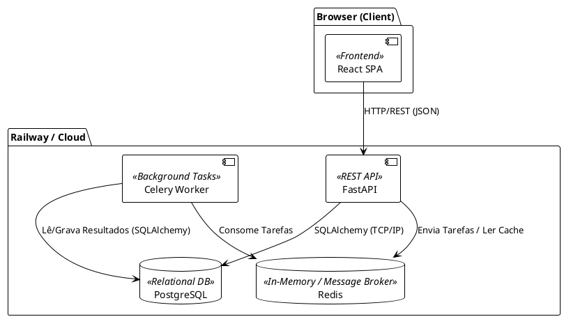
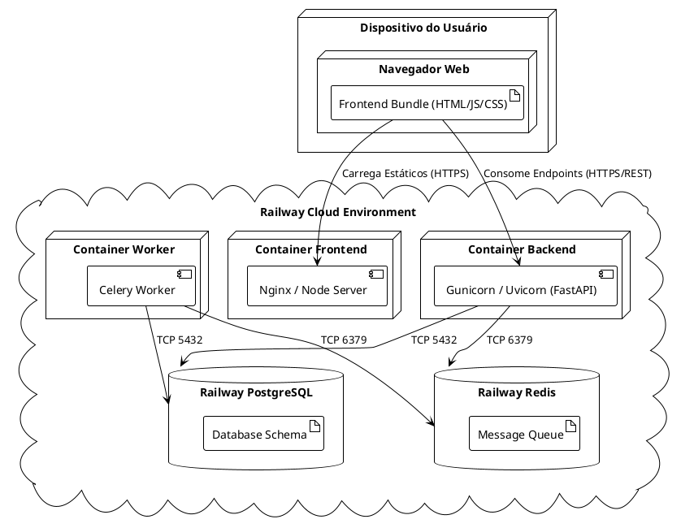

# 01 - Visão Geral e Infraestrutura

Este documento apresenta a arquitetura de alto nível do sistema Plataforma Contábil, detalhando a separação de camadas, o *stack* tecnológico adotado, e a topologia de implantação (Deployment).

## 1. Visão Arquitetural de Alto Nível

O sistema Plataforma Contábil foi projetado utilizando o modelo de **Arquitetura Orientada a Serviços (SOA)**, fortemente inspirado por princípios de *Clean Architecture* no Back-end e *Component-Based Architecture* no Front-end. 

A aplicação está dividida em 4 pilares principais:

1. **Front-end (SPA)**: Interface rica do usuário, que roda no browser.
2. **Back-end (API Restful)**: Ponto de entrada de negócio e lógica de processamento síncrono.
3. **Workers (Background Jobs)**: Processamento assíncrono para tarefas pesadas (conciliações longas, geração de relatórios, disparos de integrações).
4. **Infraestrutura de Dados**: Banco de Dados Relacional para persistência de estado (PostgreSQL) e Cache/Fila de Mensagens em memória (Redis).

### Diagrama de Componentes (Visão Macro)

## 2. Stack Tecnológico

A escolha de tecnologias foi pautada na necessidade de construir uma aplicação altamente tipada, performática e modularizada:

| Camada | Tecnologia | Motivo da Escolha | Dependências e Interações |
| :--- | :--- | :--- | :--- |
| **Front-end** | React.js + Vite + TypeScript | Performance no build (Vite), reatividade componentizada (React) e tipagem forte (TypeScript) para capturar erros em tempo de compilação. | Axios (chamadas HTTP), React Router (navegação), Tailwind CSS (Estilização). |
| **Back-end** | Python + FastAPI | Execução assíncrona super rápida, autogeração de documentação (Swagger) baseada em Pydantic (validação de dados robusta). | Uvicorn (ASGI server), Pydantic, SQLAlchemy. |
| **ORM** | SQLAlchemy (v2) + Alembic | Mapeamento robusto de entidades relacionais e rastreio seguro do versionamento do esquema do banco (Alembic). | Depende do PostgreSQL via driver `psycopg`. |
| **Mensageria/Background** | Celery | Essencial para não bloquear requisições HTTP da API enquanto processa rotinas demoradas (ex: Conciliação bancária massiva). | Depende nativamente do Redis como Message Broker. |
| **Banco de Dados** | PostgreSQL 16 | Relacionamentos complexos com integridade referencial, e capacidade de realizar joins robustos para relatórios financeiros. | Única fonte de verdade transacional. |
| **Cache/Fila** | Redis 7 | Alta performance em memória, ideal para gerenciar as filas do Celery e cache de curto prazo. | Utilizado ativamente pelo Celery e FastAPI. |

## 3. Infraestrutura e Implantação (Deployment)

O ecossistema é projetado para operar perfeitamente via **Docker Compose** localmente e ser implantado via **Railway** em ambientes de Staging/Produção.

### Diagrama de Implantação (Deployment Diagram)

### Processo de Deploy (Railway)

A configuração no Railway obedece o seguinte processo arquitetural, estabelecido no arquivo `DEPLOYMENT.md` e espelhado no ambiente local pelo `docker-compose.yml`:

1. **Provisionamento de Bancos:** Os serviços nativos PostgreSQL e Redis do Railway são instanciados primeiro, gerando URLs internas seguras (`DATABASE_URL`, `REDIS_URL`).
2. **Deploy do Backend (API):**
   * O Railway identifica o projeto Python através do repositório.
   * Variáveis de ambiente como `APP_ENV=production` e `CORS_ORIGINS` são injetadas.
   * **Migrações:** Como parte da inicialização do contêiner backend, é executado `alembic upgrade head`, garantindo que o banco de dados PostgreSQL esteja alinhado com o ORM antes que as rotas fiquem disponíveis. O código (`main.py` ou `create_first_user.py`) também aplica configurações de seeds iniciais (ex: criação do super usuário).
3. **Deploy do Worker:** O mesmo código do backend é implantado em um serviço secundário com o *Command* de inicialização alterado para iniciar o Celery (`celery -A ... worker`).
4. **Deploy do Frontend:**
   * A aplicação React/Vite faz o *build* (compilando TypeScript em JS minificado).
   * No build e/ou via entrypoint script, a URL do Backend Railway (`VITE_API_URL`) é consumida, apontando todas as requisições subsequentes do navegador para a nuvem.

### Limitações Arquiteturais Atuais e Evoluções Planejadas
* **Armazenamento de Arquivos:** No MVP atual, arquivos de notas fiscais ou extratos submetidos utilizam um `LocalStorageProvider` (salvos localmente no path `/app/uploads`). Em nuvens efêmeras como o Railway, dados no container podem ser perdidos. A evolução esperada pela arquitetura é a substituição dessa estratégia de I/O para `S3 Cloud Storage`, de modo a perenizar os anexos fiscais, conforme documentado no `DEPLOYMENT.md`.
