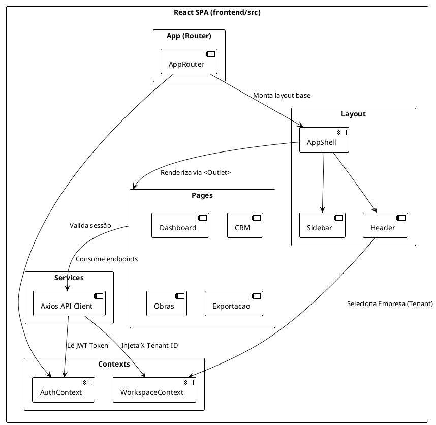

# 02 - Arquitetura Front-end (React + Vite)

Este documento detalha a arquitetura, estrutura e fluxo de navegação da aplicação Front-end da Plataforma Contábil.

## 1. Visão Geral e Frameworks

O Front-end foi construído como uma *Single Page Application* (SPA) focada em alta reatividade, forte tipagem e experiência de desenvolvedor (DX) acelerada.

* **Core:** React 18+
* **Build Tool:** Vite (substituindo o Webpack tradicional por compilação HMR quase instantânea)
* **Linguagem:** TypeScript (tipagem estática para prever erros de contrato de API em tempo de build)
* **Roteamento:** React Router DOM (v6)
* **Estilização:** Tailwind CSS (utilitários de CSS para desenvolvimento rápido e consistente) e ícones via `lucide-react`.
* **Comunicação de Rede:** Axios (com interceptors).

## 2. Estrutura de Diretórios (`frontend/src`)

A separação de responsabilidades segue um padrão modular por tipo de recurso funcional:

```
frontend/src/
├── app/            # Configurações raiz da aplicação (Router)
├── assets/         # Imagens, fontes estáticas
├── auth/           # Utilitários legados e wrapper de rotas (ProtectedRoute)
├── components/     # Componentes de UI reutilizáveis (Botões, Layout, Sidebar, Modais)
├── contexts/       # React Context API (AuthContext, WorkspaceContext)
├── hooks/          # Custom Hooks (ex: useExecution)
├── pages/          # Componentes de Nível de Rota (Containers de visão)
├── services/       # Clientes HTTP (api.ts) e chamadas ao backend
├── styles/         # Estilos globais (index.css com diretivas do Tailwind)
├── types/          # Declarações de interfaces do TypeScript (modelos de domínio no front)
└── utils/          # Funções utilitárias puras
```

## 3. Gerenciamento de Estado e Fluxo de Autenticação

O sistema prescinde de bibliotecas complexas como Redux, preferindo a **Context API** do React para estados globais (Usuário logado e Tenant Ativo) e estado local em componentes.

### Diagrama de Pacotes (Frontend)



### Fluxo de Autenticação e Multi-Tenancy

1. **Autenticação:**
   * O usuário submete credenciais em `/login` (`LoginPage.tsx`).
   * O payload decodificado do JWT é persistido no `localStorage` sob a chave `@App:user` e o token sob `@App:token`.
   * O `AuthContext` é atualizado sincronicamente.
   * O interceptor do `apiClient` (`services/api.ts`) adiciona o cabeçalho `Authorization: Bearer <token>` em todas as chamadas. Se a API retornar HTTP `401 Unauthorized`, o interceptor desloga o usuário forçadamente.

2. **Multi-Tenancy (Workspace):**
   * A Plataforma suporta múltiplas empresas.
   * O `WorkspaceContext` armazena o ID da empresa selecionada (`activeWorkspaceId`) no localStorage.
   * O interceptor do `apiClient` adiciona um cabeçalho customizado `X-Tenant-ID` em cada requisição. O Backend utiliza esse cabeçalho para isolar (filtrar) os dados contábeis pertinentes apenas àquela empresa.

## 4. Fluxo de Navegação

A navegação é controlada de forma estrita no `app/router.tsx`:

* **Rotas Públicas:** Apenas `/login`.
* **Rotas Protegidas:** Exigem `isAuthenticated` do `AuthContext`. Agrupadas sob o `<ProtectedRoute>`.
* **Layout Mestre (`AppShell`):** As rotas de negócio (Dashboard, CRM, Fiscal, Financeiro) herdam um layout master que contém o Sidebar de navegação esquerda e o Header superior.
* A renderização condicional dos módulos dentro do `AppShell` ocorre via componente `<Outlet />` nativo do React Router.

## 5. Responsabilidade das Camadas

* **Pages (Containers):** Responsáveis por amarrar a lógica. Solicitam dados aos `services`, injetam loading states, tratam erros, e orquestram a exibição delegando propriedades para os `components`.
* **Components (Apresentacionais):** Altamente reutilizáveis (como Botões, Inputs, Tabelas - `DataTable`). Recebem dados via *props* e disparam eventos (via callbacks) de volta para as *Pages*. Não possuem acesso direto aos *Services*.
* **Services:** Isola a biblioteca Axios e as rotas exatas da API, retornando Promessas. Centraliza o tratamento genérico de erros de rede.
