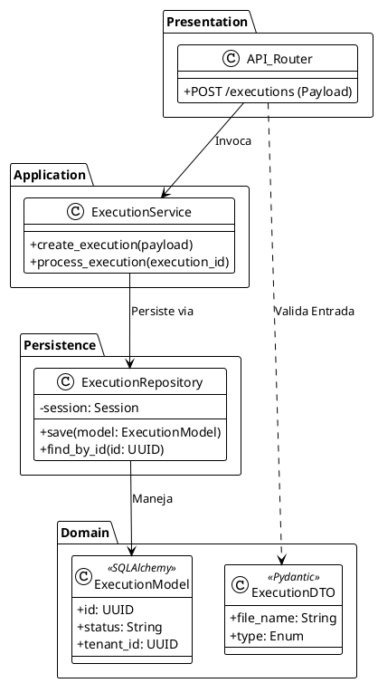
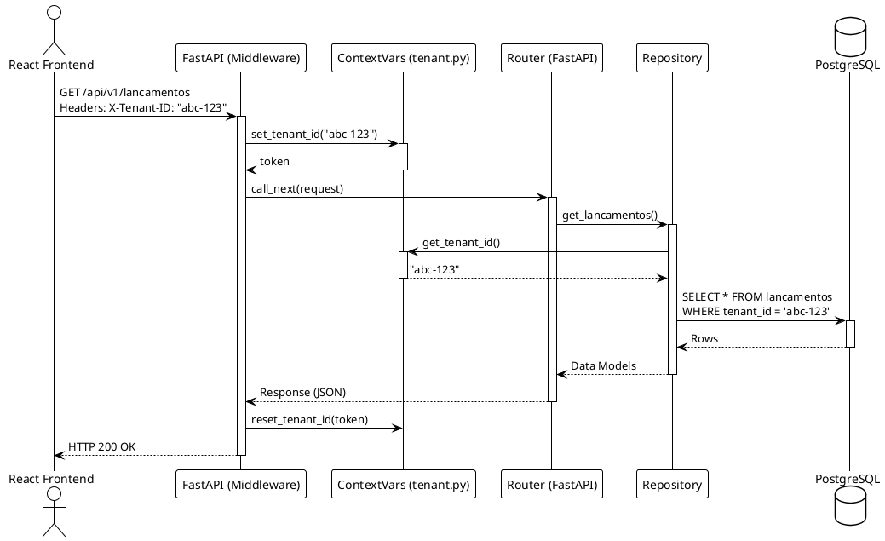

# 03 - Arquitetura Back-end (FastAPI + Clean Architecture)

Este documento descreve a estrutura interna da API, frameworks utilizados, a implementação de Multi-Tenancy e a separação de responsabilidades (Clean Architecture e Domain-Driven Design).

## 1. Visão Geral e Frameworks

* **Core:** Python 3.12+
* **Web Framework:** FastAPI (ASGI, Pydantic, Starlette) para alta performance e OpenAPI (Swagger) nativo.
* **ORM:** SQLAlchemy 2.0 (com sessões gerenciadas via injeção de dependências).
* **Migrations:** Alembic.
* **Background Jobs:** Celery (usando Redis como broker).

## 2. Estrutura Modular e Bounded Contexts

O código-fonte (`backend/app`) está organizado combinando *Clean Architecture* com contextos delimitados (DDD), dividindo o domínio gigante da contabilidade em módulos independentes:

```
backend/app/
├── api/             # Rotas legadas/comuns e injeção de dependências genéricas (deps.py)
├── contexts/        # Bounded Contexts (Onde a lógica de negócio principal vive)
│   ├── analytics/
│   ├── conectores_erp/
│   ├── exportacao/
│   ├── fiscal_engine/
│   ├── identity/    # Auth, Login, JWT
│   ├── matching_auditing/
│   ├── obras/
│   └── staging_ingestion/
├── core/            # Configurações globais (settings.py), Multi-Tenancy (tenant.py), Segurança
├── models/          # Entidades do SQLAlchemy (Domain Models compartilhados)
├── schemas/         # Modelos Pydantic (DTOs / ViewModels)
├── services/        # Serviços globais / cross-context
├── tasks.py         # Orquestração de Jobs do Celery
└── main.py          # Ponto de entrada do FastAPI e registro de middlewares
```

## 3. Fluxo de Requisições e Responsabilidades (Camadas)

A aplicação segue rigorosamente um fluxo unidirecional de dependências:

1. **Router/Controller (`api.py` ou `routers/`)**:
   * Recebe a requisição HTTP.
   * Depende do Pydantic (Schemas) para validação de entrada (Request DTOs).
   * Chama o Service ou Use Case correspondente.
2. **Service / Use Case (`services/` ou dentro do context)**:
   * Contém a **Regra de Negócio**.
   * Não sabe nada sobre HTTP ou FastAPI.
   * Interage com Repositórios para buscar/salvar entidades de Domínio.
3. **Repository (`repositories/`)**:
   * Abstrai o SQLAlchemy.
   * Realiza operações no banco de dados (`session.execute`, `session.query`).
4. **Domain / Models (`models/`)**:
   * Entidades de banco mapeadas declarativamente (SQLAlchemy).

### Diagrama de Classes e Dependências (Exemplo: Fluxo de Execução)



## 4. Multi-Tenancy (Isolamento de Dados por Empresa)

Para garantir que os dados contábeis de uma empresa não vazem para outra, a aplicação implementa **Multi-Tenancy lógico** ao nível de middleware.

1. O cliente (Front-end) envia o cabeçalho `X-Tenant-ID`.
2. O `tenant_middleware` no `main.py` intercepta a requisição.
3. Utiliza `contextvars` (nativo do Python assíncrono) dentro de `app/core/tenant.py` para injetar o `tenant_id` no contexto global da thread/task assíncrona.
4. Os Repositórios e Serviços leem esse `contextvar` e filtram automaticamente (ou injetam na gravação) o `workspace_id` correto via queries SQLAlchemy.

### Diagrama de Sequência: Multi-Tenancy e ContextVars



## 5. Autenticação e JWT

O módulo `identity` é responsável pela autenticação. O fluxo baseia-se no OAuth2 Password Flow.
* Usuário faz `POST /login` com email/senha.
* Backend verifica hash e gera um token JWT.
* As rotas são protegidas via dependência do FastAPI (`Depends(get_current_user)`).

## 6. Workers Assíncronos (Celery)

Para a rotina de ingestão e reconciliação (que envolve ler planilhas pesadas, criar centenas de milhares de lançamentos via motor fiscal), o FastAPI jamais bloqueia a requisição HTTP. 

Ele enfileira uma Task no Celery:
```python
task = processar_planilha_task.delay(execution_id, tenant_id)
```
O *Worker* independente apanha essa tarefa na fila Redis, executa as chamadas pesadas ao Banco de Dados e atualiza o Status da `ExecutionModel` para concluído ou com erro.
