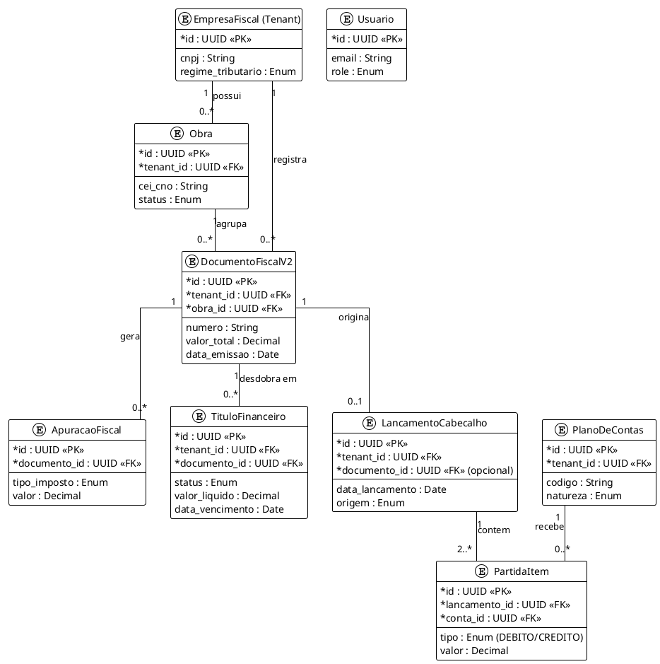

# 04 - Banco de Dados e Modelagem (SQLAlchemy)

Este documento documenta o esquema relacional atualizado do sistema Plataforma Contábil, incluindo entidades legadas e as novas introduzidas na refatoração da Arquitetura V2.

## 1. Stack e Ferramentas

* **SGBD:** PostgreSQL 16
* **ORM:** SQLAlchemy 2.0 (Estilo Declarativo)
* **Controle de Migrações:** Alembic
* **Padrões de Design:**
  * UUID4 como chave primária para todas as entidades (segurança e distribuição).
  * Timestamps automáticos (`created_at`, `updated_at`).
  * `tenant_id` (Empresa) em quase todas as entidades transacionais (para suportar Multi-Tenancy nativo).

## 2. Divisão Lógica do Domínio (Módulos)

O banco está particionado logicamente através de arquivos Python em `backend/app/models/`, refletindo bounded contexts distintos.

### Domínio de Identidade e Sistema
* **Usuario:** Credenciais e Controle de Acesso (Role: ADMIN, etc.).
* **Empresa / EmpresaFiscal:** O Tenant raiz. EmpresaFiscal herda configurações de Regime Tributário (Lucro Real, Presumido, Simples).
* **ExecucaoPipeline / StagingRegistro:** Controle de jobs de importação (extratos, relatórios).

### Domínio Fiscal e Obras
* **Obra / Subempreiteiro:** Centros de custo isolados com tributação própria (ex: RET - Regime Especial de Tributação).
* **DocumentoFiscalV2:** Notas Fiscais, Faturas. Substitui o legado `DocumentoFiscal`.
* **ParcelaDocumentoFiscal:** Desdobramento de NFs.
* **ApuracaoFiscal / DetalheImposto:** Registro de impostos calculados (PIS, COFINS, ISS, INSS).

### Domínio Financeiro (Tesouraria)
* **TituloFinanceiro:** Títulos a pagar / a receber.
* **MovimentacaoFinanceira:** Extratos bancários reais (conciliados).
* **ConciliacaoFinanceira:** Relacionamento NxM entre Títulos, Documentos e Movimentações.

### Domínio Contábil (Ledger)
* **PlanoDeContas:** Árvore hierárquica contábil.
* **PeriodoContabil:** Controle de fechamento de competências (Aberto/Fechado).
* **LancamentoCabecalho:** O diário contábil principal.
* **PartidaItem:** Partidas dobradas (Débito e Crédito associadas a um Lançamento).

## 3. Diagrama de Entidade-Relacionamento (ER / UML)

Abaixo o diagrama de relacionamento das entidades **foco da Arquitetura V2**, excluindo o legado transiente para melhor visibilidade do core business atual:

## 4. Fluxo de Migrações (Alembic)

A evolução do schema é tratada *exclusivamente* via Alembic:

1. Modela-se a classe herdeira de `Base` em `backend/app/models/`.
2. O desenvolvedor gera o script: `alembic revision --autogenerate -m "nome"`.
3. O script (`backend/alembic/versions/`) contém funções `upgrade()` e `downgrade()`.
4. Em ambiente produtivo, o deploy do Railway dispara `alembic upgrade head` como primeira etapa. Nenhuma modificação DDL direta no banco é permitida.
