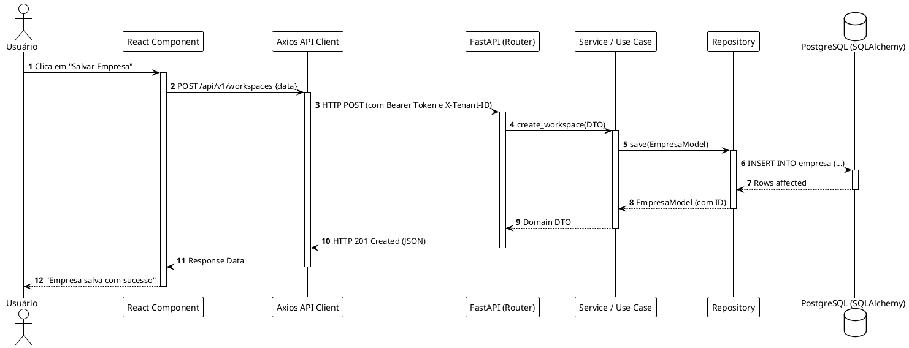
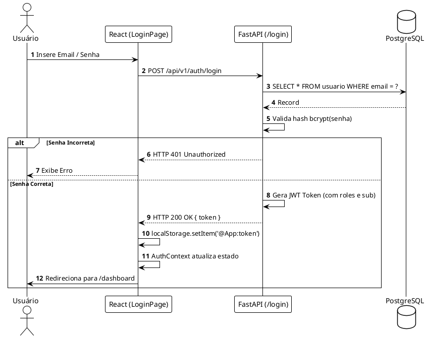
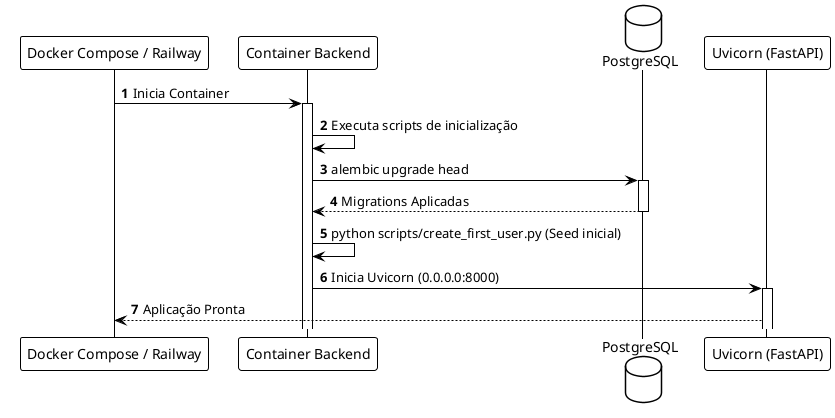
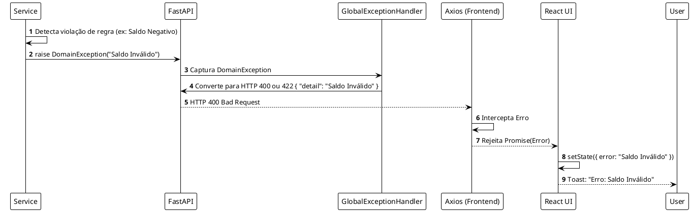

# 05 - Fluxos de Dados e Ciclo de Vida

Este documento detalha o ciclo de vida das requisições na Plataforma Contábil através de 8 cenários-chave e diagramas PlantUML.

## 1. Fluxo Completo Arquitetural (Caminho Feliz)

Demonstra a jornada de ponta a ponta desde a interface até o banco de dados.

## 2. Fluxo de Autenticação (OAuth2)

## 3. Fluxo de Inicialização da Aplicação

## 4. Fluxo de Tratamento de Exceções

A aplicação usa *Exception Handlers* globais no FastAPI para interceptar erros da camada de domínio.

## 5. Fluxos de CRUD (Create, Update, Delete, Query)

### Criação (Create)
O POST valida o Pydantic DTO → Repository instancia `Model(...)` → `session.add(model)` → `session.commit()` → `session.refresh(model)`.

### Atualização (Update)
O PUT/PATCH/POST valida DTO → Repository busca a entidade `session.get(id)` → Altera propriedades do modelo retornado → `session.commit()`.

### Exclusão (Delete)
O DELETE (ou Soft Delete) → Repository busca `session.get(id)` → `session.delete(model)` (ou `model.deleted = True`) → `session.commit()`. 

### Consultas (Queries / Read)
O GET → Repository executa `session.query().filter().all()` → Lista de models é mapeada automaticamente para List[Pydantic_Schema] pelo FastAPI (graças a `from_attributes=True` ou `orm_mode`).

*Fim da Documentação Arquitetural.*
