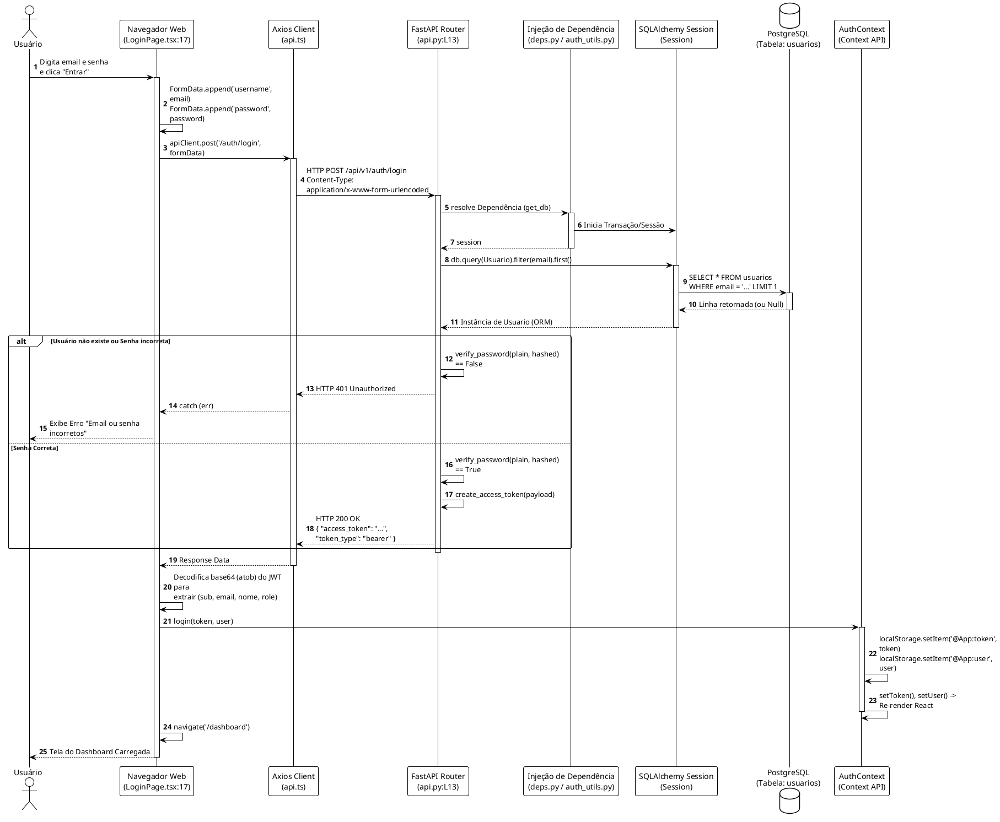

# LLD (Low-Level Design): Domínio Identity & Autenticação

## 1. Visão Geral do Módulo
O módulo `identity` é responsável pela segurança, gestão de acesso (Autenticação/Autorização) e controle de Sessão (JWT) do sistema Plataforma Contábil.

* **Localização Principal:** `backend/app/contexts/identity/`
* **Dependências Externas:** 
  * `passlib` / `bcrypt` para hash de senhas.
  * `python-jose` para geração e parsing de JWT.
  * `OAuth2PasswordBearer` (FastAPI nativo).

## 2. Modelos e Entidades (Domain)

### 2.1 Entidade `Usuario`
**Arquivo:** `backend/app/models/domain.py:14`
**Responsabilidade:** Representar a conta de um ser humano no sistema.

* **Chave Primária:** `id` (String de 36 posições gerando `uuid4`).
* **Atributos:**
  * `email` (String único e indexado).
  * `hashed_password` (String do Bcrypt).
  * `nome` (String).
  * `role` (Enum: ADMIN, ANALISTA, AUDITOR).
  * `empresa_id` (UUID ForeignKey para `Empresa`, nullable para admins globais).
  * `is_active` (Booleano, default=True).
* **Relacionamentos:**
  * `workspaces`: Relacionamento 1:N com `WorkspaceMember`.

## 3. Serviços Internos (Utils)

### 3.1 Funções Criptográficas
**Arquivo:** `backend/app/contexts/identity/auth_utils.py`

* `get_password_hash(password: str) -> str`: (Linha 24)
  * Usa `bcrypt.hashpw` com um salt automático.
  * *Ponto de Entrada:* Criação de usuários (seed).
* `verify_password(plain, hashed) -> bool`: (Linha 18)
  * Compara a senha em plain text do payload com o hash armazenado no banco.

### 3.2 Geração e Injeção de Token (JWT)
**Arquivo:** `backend/app/contexts/identity/auth_utils.py`

* `create_access_token(data: dict) -> str`: (Linha 27)
  * Usa o `SECRET_KEY` e `ALGORITHM` (HS256) das variáveis de ambiente.
  * Expiração padrão: 15 minutos (ou tempo parametrizável).
* `get_current_user(...) -> Usuario`: (Linha 37)
  * **Injeção de Dependência:** Extrai o Header `Authorization: Bearer <token>`.
  * Lança `HTTP 401` se falhar a validação ou se o usuário não for encontrado no banco.

---

## 4. Endpoints Mapeados

### Endpoint: `POST /api/v1/auth/login`
Responsável por autenticar o usuário e retornar um token JWT. Implementa a especificação OAuth2 do FastAPI.

* **Arquivo:** `backend/app/contexts/identity/api.py:L13`
* **Autenticação Requerida:** Nenhuma (Endpoint Aberto).
* **Parâmetros / Request Body:** 
  * `OAuth2PasswordRequestForm` (Recebido em formato `application/x-www-form-urlencoded`).
  * Propriedades esperadas: `username` (email) e `password`.
* **Fluxo de Execução:**
  1. A injeção de dependência fornece o objeto `form_data` e a `Session` (banco de dados) via `Depends(get_db)`.
  2. Executa Query no banco: `db.query(Usuario).filter(Usuario.email == form_data.username).first()`.
  3. Checa a senha (`verify_password()`).
  4. Se falhar, dá raise em `HTTPException(401)`.
  5. Se tiver sucesso, cria o token contendo o `sub` (id do usuario), `email`, `nome` e `role`.
* **Retorno:** JSON no formato `{ "access_token": "ey...", "token_type": "bearer" }`.

#### PlantUML: Fluxo Completo de Autenticação (LLD)

### Endpoint: `POST /api/v1/auth/seed-admin`
Responsável por injetar de forma programática os usuários iniciais no banco de dados.

* **Arquivo:** `backend/app/contexts/identity/api.py:L30`
* **Autenticação Requerida:** Nenhuma, mas **bloqueado em ambiente produtivo**.
* **Parâmetros:** Nenhum.
* **Fluxo de Execução:**
  1. Verifica `settings.APP_ENV == "production"`. Se sim, `raise 403`.
  2. Abre uma Unit of Work (`SQLAlchemyUnitOfWork`).
  3. Verifica se o usuário `admin@contabil.com` já existe via Query.
  4. Caso não exista, cria 3 entidades `Usuario` em memória: Admin, Analista e Auditor. Todas recebem senhas encriptadas pela função `get_password_hash()`.
  5. Adiciona os 3 objetos: `uow.session.add_all([admin, analista, auditor])`.
  6. Efetiva transação `uow.commit()`.
* **Retorno:** JSON com `{ "message": "Seed executado" }`.
