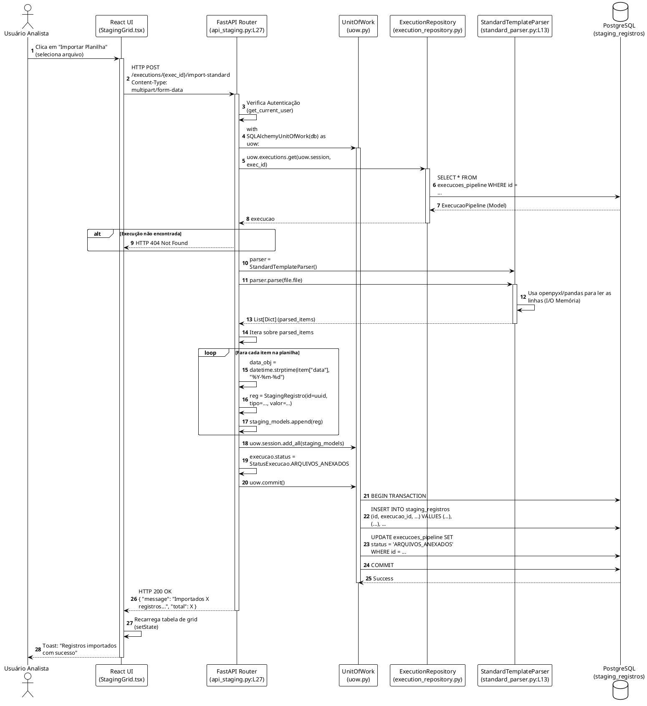

# LLD: Domínio de Ingestão e Staging (staging_ingestion)

## 1. Visão Geral do Módulo
O módulo `staging_ingestion` é a porta de entrada de dados da aplicação. Ele é responsável por orquestrar execuções assíncronas (via Celery), parsear planilhas padronizadas (Upload) e salvar dados temporários na área de "Staging" antes de injetá-los no motor fiscal e contábil.

* **Localização Principal:** `backend/app/contexts/staging_ingestion/`
* **Dependências Externas:** 
  * `Celery` / `Redis` para background jobs.
  * `openpyxl` / `pandas` para parseamento de arquivos XLSX (via `StandardTemplateParser`).
  * `EventBus` para arquitetura orientada a eventos (EDA).

## 2. Modelos e Entidades (Domain)

### 2.1 Entidade `ExecucaoPipeline`
**Arquivo:** `backend/app/models/domain.py`
**Responsabilidade:** Rastrear o ciclo de vida de uma importação de dados.
* **Tabela:** `execucoes_pipeline`
* **Atributos Principais:** 
  * `id` (UUID4)
  * `empresa_id` (UUID - Multi-tenant isolation)
  * `status` (Enum: CRIADA, ARQUIVOS_ANEXADOS, PROCESSANDO, AGUARDANDO_REVISAO_STAGING, CONCILIANDO, CONCLUIDA, ERRO).
  * `matching_profile` (String, ex: "financeiro_2026").
  * `hashes_arquivos` (JSON contendo sha256 dos arquivos upados).

### 2.2 Entidade `StagingRegistro`
**Arquivo:** `backend/app/models/domain.py`
**Responsabilidade:** Armazenar dados contábeis brutos parseados da planilha do usuário antes da conciliação real.
* **Tabela:** `staging_registros`
* **Relacionamento:** `execucao_id` aponta para `ExecucaoPipeline`.
* **Atributos:** `data`, `descricao`, `valor`, `tipo` (Despesa, Receita, etc), `cnpj_cpf`, `categoria`.

## 3. Repositórios
O acesso ao banco no backend é envelopado pela classe `SQLAlchemyUnitOfWork` (em `backend/app/core/uow.py`), que centraliza `uow.executions.get()`.

---

## 4. Endpoints Mapeados

### Endpoint 1: `POST /api/v1/executions`
**Arquivo:** `backend/app/contexts/staging_ingestion/api_executions.py:L49`
* **Objetivo:** Inicializa uma nova execução em branco para a empresa.
* **Validação:** Checa se a role do `current_user` permite agir sobre a `empresa_id` informada.
* **Persistência:** Cria um `ExecucaoPipeline` com status `CRIADA`.

### Endpoint 2: `POST /executions/{exec_id}/import-standard`
**Arquivo:** `backend/app/contexts/staging_ingestion/api_staging.py:L27`
* **Objetivo:** Fazer upload da "Planilha_Padrao_Contabil.xlsx" e gerar o Staging.
* **Autenticação:** JWT Bearer Token (`Depends(get_current_user)`).
* **Parâmetros:** `file` (UploadFile).
* **Fluxo:**
  1. Consulta a execução `uow.executions.get()`. Lança HTTP 404 se não achar.
  2. Instancia `StandardTemplateParser()` (localizado em `parsers/standard_parser.py`).
  3. Varre as linhas do arquivo e instancia dezenas de `StagingRegistro`.
  4. Executa um bulk insert: `uow.session.add_all(staging_models)`.
  5. Atualiza status: `execucao.status = StatusExecucao.ARQUIVOS_ANEXADOS`.
  6. Efetua `uow.commit()`.

### Endpoint 3: `POST /executions/{exec_id}/staging/process`
**Arquivo:** `backend/app/contexts/staging_ingestion/api_staging.py:L89`
* **Objetivo:** Processar o Staging (Transformar o bruto em Documentos Fiscais e Lançamentos).
* **Fluxo:**
  1. Busca itens pendentes no staging usando o repository `get_staging_pendentes`.
  2. Invoca o serviço de domínio `StagingService(uow.session).process_staging_items()`.
  3. **Event-Driven:** Publica o evento `EventBus.publish("FilesIngestedEvent", exec_id=exec_id)`.
* **Retorno:** Resumo tributário (`tax_summary`).

---

## 5. PlantUML: Fluxo de Importação e Parseamento de Arquivo (LLD)

Este diagrama representa o caminho exato do **Endpoint 2** (`import-standard`).

