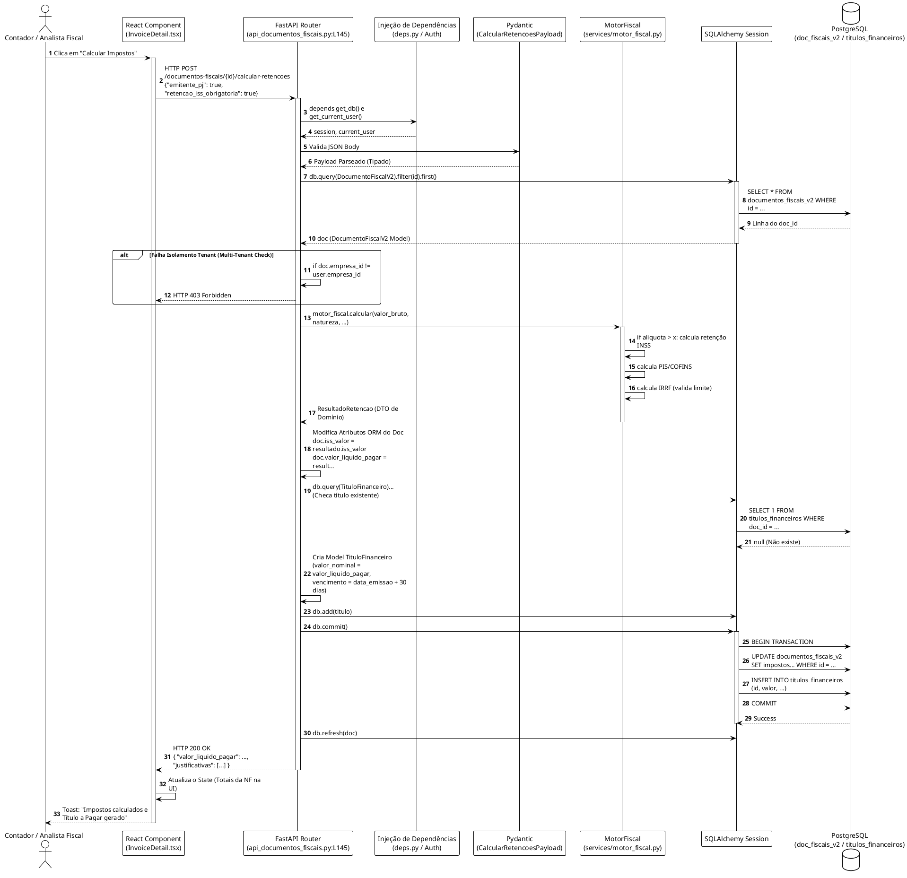

# LLD: Domínio Core (Obras e Documentos Fiscais)

## 1. Visão Geral do Módulo
Este módulo é o coração da regra de negócio para Construtoras e Incorporadoras. Ele gerencia as Obras (Centros de Custo com apurações próprias, como o RET - Regime Especial de Tributação) e o ciclo de vida dos Documentos Fiscais (V2), incluindo o cálculo avançado de impostos retidos na fonte através do `MotorFiscal` e a orquestração de lançamentos via `GeradorLancamentos`.

* **Localização Principal:** `backend/app/contexts/obras/`
* **Dependências Chaves:**
  * `MotorFiscal` (`app/services/motor_fiscal.py`): Realiza cálculos de INSS, ISS, PIS/COFINS, IR.
  * `GeradorLancamentos` (`app/services/gerador_lancamentos.py`): Aplica partidas dobradas.

## 2. Modelos e Entidades (Domain)

### 2.1 Entidade `Obra`
**Arquivo:** `backend/app/models/obra.py`
**Responsabilidade:** Representar um empreendimento de engenharia com suas regras tributárias isoladas.
* **Tabela:** `obras`
* **Atributos Principais:** 
  * `id` (UUID4)
  * `empresa_id` (UUID - Isola multi-tenancy)
  * `codigo_cno` (String: Cadastro Nacional de Obras)
  * `patrimonio_afetacao` (Booleano: isolamento de bens)
  * `regime_tributario` (Enum: RET, NORMAL, SCP)
  * `percentual_avanco_fisico` (Float: CPC 17)

### 2.2 Entidade `DocumentoFiscalV2`
**Arquivo:** `backend/app/models/documento_fiscal.py`
**Responsabilidade:** Representar uma Nota Fiscal ou Fatura (despesa ou receita) e todas as suas retenções tributárias acopladas.
* **Tabela:** `documentos_fiscais_v2`
* **Relacionamento Essencial:** `obra_id` (ForeignKey) – vincula o custo/receita à obra.
* **Atributos Tributários:** 
  * `valor_bruto` (Decimal)
  * `iss_retido_fonte` (Boolean), `iss_valor` (Decimal)
  * `ir_retido`, `inss_retido`, `pis_valor`, `cofins_valor`...
  * `valor_liquido_pagar` (Decimal)

---

## 3. Endpoints Mapeados (Módulo `api_obras.py`)

### Endpoint 1: Criação de Obra (`POST /api/v1/obras`)
* **Arquivo:** `backend/app/contexts/obras/api_obras.py:L127`
* **Objetivo:** Registrar um novo centro de custo.
* **Validação:** Exige payload `ObraCreate` (Pydantic Schema). Checa se usuário é `ADMIN` ou `ANALISTA`.
* **Fluxo:** Cria modelo `Obra` -> `db.add(obra)` -> `db.commit()` -> `db.refresh()`.

### Endpoint 2: Atualizar Avanço Físico (`PATCH /api/v1/obras/{obra_id}/avanco`)
* **Arquivo:** `backend/app/contexts/obras/api_obras.py:L184`
* **Regra de Negócio:** Conforme CPC 17, o reconhecimento da receita da construtora é baseado no avanço da obra. Modifica a propriedade `percentual_avanco_fisico`.

---

## 4. Endpoints Mapeados (Módulo `api_documentos_fiscais.py`)

### Endpoint 1: Vincular à Obra (`PATCH /api/v1/documentos-fiscais/{doc_id}/vincular-obra`)
* **Arquivo:** `api_documentos_fiscais.py:L118`
* **Validação:** Verifica isolamento multi-tenant (`doc.empresa_id == current_user.empresa_id`).
* **Operação:** `doc.obra_id = payload.obra_id` -> `db.commit()`.

### Endpoint 2: Calcular Retenções (`POST /api/v1/documentos-fiscais/{doc_id}/calcular-retencoes`)
* **Arquivo:** `api_documentos_fiscais.py:L145`
* **Objetivo:** Processamento de domínio pesado (Motor Fiscal) para deduzir impostos.
* **Fluxo:**
  1. Extrai o DocumentoFiscalV2.
  2. Invoca o singleton local: `resultado = motor_fiscal.calcular(valor, natureza...)`.
  3. Atualiza os 16 campos de impostos na entidade `doc`.
  4. **Side-effect / Criação Indireta:** Se a retenção foi feita, gera automaticamente um `TituloFinanceiro` a pagar para o fornecedor com o `valor_liquido_pagar` usando o vencimento (emissão + 30 dias).
  5. Efetiva transação (`db.commit()`).

### Endpoint 3: Gerar Lançamentos Contábeis (`POST /api/v1/documentos-fiscais/{doc_id}/gerar-lancamentos`)
* **Arquivo:** `api_documentos_fiscais.py:L226`
* **Objetivo:** Traduzir a Nota Fiscal em Débitos e Créditos (Rascunho).
* **Fluxo:**
  1. Instancia o Service: `gerador = GeradorLancamentos(db)`.
  2. Chama `gerador.gerar_para_documento(doc)`.
  3. Persiste a matriz de lançamentos: `db.add_all(lancamentos)`.
* **Exceção Tratada:** Captura `ValueError` e mapeia para `HTTPException(422)`.

---

## 5. PlantUML: Fluxo de Cálculo de Retenções Fiscais e Geração de Contas a Pagar (LLD)

Este diagrama disseca as chamadas do endpoint de **Calcular Retenções**, cobrindo a arquitetura em 11 camadas e demonstrando como uma tabela impacta outra (Documento -> Titulo Financeiro).

