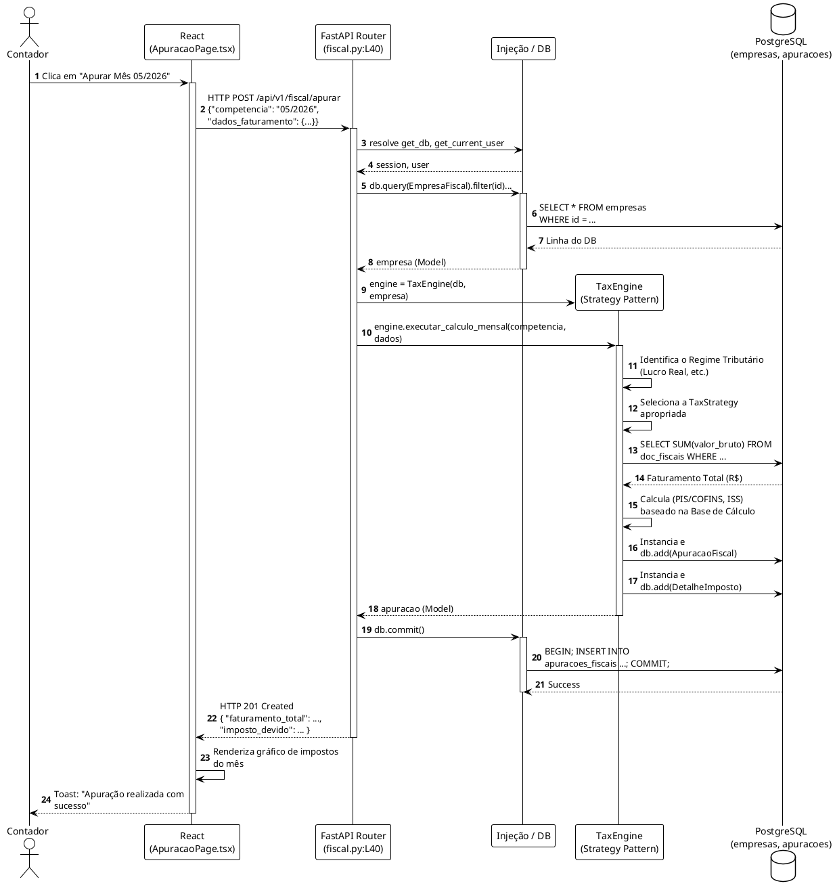

# LLD: Domínio Financeiro, Contábil (Ledger) e Fiscal

## 1. Visão Geral dos Módulos
Esta fase abrange três grandes pilares interdependentes:
1. **Financeiro (Tesouraria):** Controle de Contas a Pagar/Receber e Conciliação Bancária.
2. **Contábil (Ledger):** Motor de partidas dobradas e consolidação mensal.
3. **Fiscal e Obrigações:** Apuração de guias e geração de relatórios legais (SPED ECD).

* **Localização Principal:** `backend/app/api/routers/financeiro.py`, `fiscal.py`, `sped.py`.

## 2. Modelos e Entidades (Domain)

### 2.1 Domínio Financeiro
**Arquivo:** `backend/app/models/financeiro.py`
* **TituloFinanceiro:** Representa a duplicata (a pagar/receber).
* **MovimentacaoFinanceira:** Linha crua de extrato bancário (OFX/Open Finance).
* **ConciliacaoFinanceira:** Tabela NxM para fazer o "match" automático ou manual entre o Título e a Movimentação.

### 2.2 Domínio Contábil (Ledger)
**Arquivo:** `backend/app/models/ledger.py`
* **PeriodoContabil:** Garante a imutabilidade do Ledger, travando meses `FECHADO`s.
* **LancamentoCabecalho:** O Fato Contábil (ex: Pagamento de Fornecedor).
* **PartidaItem:** Débito ou Crédito. Uma transação básica terá 2 partidas.

### 2.3 Domínio Fiscal
**Arquivo:** `backend/app/models/fiscal.py` e `obrigacoes.py`
* **ApuracaoFiscal / DetalheImposto:** Guarda o PIS/COFINS/ISS calculado no final do mês.
* **ObrigacaoAcessoriaJob:** Rastreia tarefas de longa duração do SPED no Celery.

---

## 3. Endpoints Mapeados: Financeiro

### Endpoint: Conciliação Automática (`POST /api/v1/financeiro/conciliar`)
* **Arquivo:** `api/routers/financeiro.py:L130`
* **Objetivo:** Aciona o motor algorítmico que tenta achar pares entre Extrato e Fatura.
* **Fluxo Interno:** Instancia `ReconciliacaoService(db)`. Chama o método `rodar_motor_conciliacao()`.

### Endpoint: DRE Gerencial de Caixa (`GET /api/v1/financeiro/dre-gerencial`)
* **Arquivo:** `api/routers/financeiro.py:L146`
* **Lógica:** Filtra todos os `TituloFinanceiro` cujo `status == LIQUIDADO` dentro de um mês/ano.
* **Cálculo (L178):** `receitas_operacionais` = soma de Títulos `RECEBER`. `despesas_operacionais` = soma de Títulos `PAGAR`.

---

## 4. Endpoints Mapeados: Fiscal e SPED

### Endpoint: Apuração Mensal (`POST /api/v1/fiscal/apurar`)
* **Arquivo:** `api/routers/fiscal.py:L40`
* **Fluxo Interno:** 
  1. Busca a `EmpresaFiscal`.
  2. Inicializa o padrão de projeto Strategy: `TaxEngine(db, empresa)`.
  3. Chama `engine.executar_calculo_mensal()`. Se ocorrer erro, faz `db.rollback()`.

### Endpoint: SPED ECD (`POST /api/v1/sped/ecd`)
* **Arquivo:** `api/routers/sped.py:L20`
* **Assincronicidade Extrema:** Montar o SPED pode levar dezenas de minutos para empresas com milhares de lançamentos.
* **Fluxo Interno:**
  1. Cria um `ObrigacaoAcessoriaJob` com `status=PENDENTE`.
  2. Submete pro Celery: `gerar_sped_ecd_job.delay(str(job.id))`.
  3. Retorna HTTP 202 Accepted imediatamente. O front-end deverá fazer "polling" chamando `/status/{job_id}`.

---

## 5. PlantUML: Fluxo do Motor de Apuração Fiscal (LLD)

Este diagrama detalha a invocação do `TaxEngine` e a separação de responsabilidades para evitar que uma requisição falha comprometa o banco.

