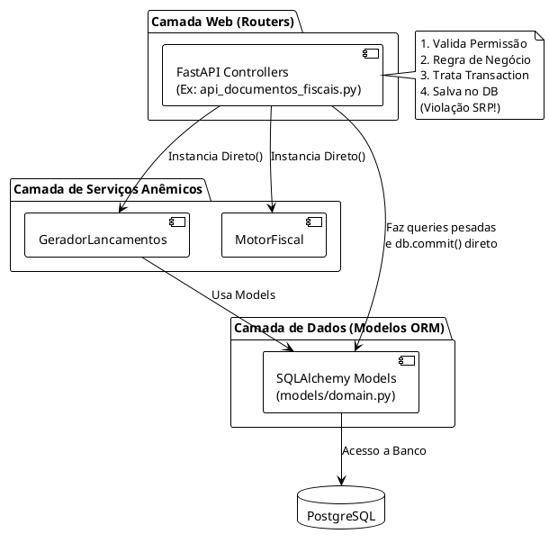
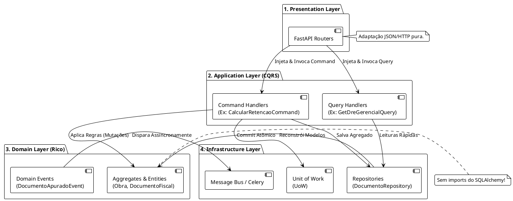

# Proposta de Arquitetura Ideal (Future State) 🏗️

A arquitetura atual do sistema, como revelado na nossa auditoria (Code Review), possui um alto grau de acoplamento nos *Controllers (Routers)*, lógica de domínio espalhada e falhas estruturais de segurança (como o isolamento Multi-Tenant manual).

Para suportar o crescimento da Plataforma Contábil com máxima manutenibilidade, proponho uma evolução estrutural baseada no estado da arte da Engenharia de Software.

---

## 1. Princípios Adotados

- **Clean Architecture:** Desacoplar a Regra de Negócio (Domínio) de frameworks externos (FastAPI, SQLAlchemy, Celery). O Banco de Dados deve ser um detalhe.
- **Vertical Slice Architecture:** Ao invés de pastas horizontais gigantes (ex: `models/`, `routers/`, `services/`), os diretórios são fatiados por **Funcionalidades (Features)**. Exemplo: `app/features/documentos_fiscais/`.
- **Domain-Driven Design (DDD):** Modelos ricos. A lógica de negócio reside dentro das entidades, e não em scripts soltos de serviços anêmicos.
- **CQRS (Command Query Responsibility Segregation):** Separação estrita entre "Comandos" (Mutações que escrevem no banco) e "Queries" (Consultas rápidas de leitura otimizadas).
- **Dependency Injection (DI):** Abandono de instâncias diretas (`MotorFiscal()`) em favor de injeção pelos construtores ou rotas, permitindo total testabilidade e uso de Mocks.
- **Unit of Work (UoW) e Repository Pattern:** Centralização de commits e rollbacks. Os repositórios escondem queries SQLAlchemy complexas.
- **Event Driven:** Desacoplamento de *side-effects*. (Ex: Ao criar um Documento Fiscal, dispara um evento `DocumentoProcessadoEvent`. Outro listener escuta e cria o `TituloFinanceiro` independente).

---

## 2. O Contraste Arquitetural (Atual vs. Proposto)

### 2.1 Arquitetura Atual (O "Controlador Gordo")

A arquitetura atual possui uma dependência linear e forte entre as camadas mais periféricas e o banco de dados.



### 2.2 Arquitetura Proposta (Clean Architecture + CQRS + Event Driven)

Na nova estrutura, o **Domínio** está no centro e não depende de ninguém. Os fluxos são encapsulados em *Use Cases* (Application Services) via Command/Query Handlers.



---

## 3. O Que Mudaria na Prática?

### 1. Separação por Vertical Slices (Módulos Coesos)

**Antes:** `app/models`, `app/api`, `app/services`.
**Depois:** `app/modules/fiscal/`, `app/modules/financeiro/`. Tudo relacionado à apuração fiscal (Controller, Schema, Repository, Entity, Tests) mora no mesmo lugar. Aumenta absurdamente a coesão.

### 2. Segurança Multi-Tenant Embutida (Row-Level Security/Contexto)

**Antes:** O Dev precisava escrever `if str(doc.empresa_id) != user.empresa_id:` em toda rota.
**Depois:** Cria-se um `MultiTenantUnitOfWork` ou um `BaseRepository` que intercepta o ContextVar do ID do Tenant (já existe o middleware na base atual) e **automaticamente injeta o filtro** em toda e qualquer query gerada. O desenvolvedor não precisa mais se preocupar; o vazamento torna-se matematicamente impossível.

### 3. Fim do `.all()` (Query Handlers Otimizados)

**Antes:** `GET /dre-gerencial` buscava `titulos = query.all()` pro Python somar.
**Depois:** Uma classe `GetDreGerencialQueryHandler` utiliza SQL raw puro, ou Dapper/SQLAlchemy Core para compilar uma `SELECT SUM(valor) GROUP BY ...`. Isso devolve o número consolidado no banco. Redução de 99% na alocação de memória (RAM).

### 4. Controle de Efeitos Colaterais via Event Driven

**Antes:** O endpoint `CalcularRetencoes` pegava a NF e já inseria um Título Financeiro a pagar na força bruta. Acoplamento enorme.
**Depois:** O Command `CalcularRetencoesCommandHandler` apenas atualiza a NF e emite um evento local na memória: `EventBus.publish(ImpostosRetidosEvent(doc_id))`.
No módulo Financeiro, um Listener assíncrono capta a mensagem e gera o Título automaticamente. Se falhar, é feito "retry" ou armazenado em fila Dead-Letter sem quebrar o HTTP Response do usuário.

### 5. Controle de Transação (Unit of Work via Context Manager)

**Antes:** `db.add()`, `db.commit()` e `db.refresh()` jogados no meio das lógicas IF/ELSE dos rotas.
**Depois:**

```python
with uow:
    doc = uow.documentos.get(id)
    doc.calcular_impostos()
    uow.commit() # Dispara persistência + eventos 
```

---

## 4. Ganhos Esperados

| Fator | Arquitetura Atual | Arquitetura Proposta | Ganhos Estimados |
| :--- | :--- | :--- | :--- |
| **Manutenibilidade** | Refatorações quebram módulos adjacentes por alto acoplamento. | *Vertical Slices* isolam as falhas apenas na "Feature" tocada. | **+70% de velocidade** em features complexas. Onboarding de Devs é rápido. |
| **Segurança (Tenants)** | Manual, vulnerável a erro humano. | Interceptação na base do ORM. Invulnerável ao esquecimento. | **Risco Zero** de vazamento de dados de faturamento (LGPD). |
| **Performance (I/O & RAM)** | Carrega todos os objetos em memória antes de agrupar (`.all()`). | CQRS otimiza Views e Projeções direto no SGBD. Paginação obrigatória. | **-90% de uso de Memória RAM** em relatórios contábeis massivos (N+1 eliminado). |
| **Escalabilidade (Processos)** | Transações longas prendem a thread do FastAPI (Síncrono/Espera de Side Effects). | Event-Bus propaga a criação de títulos/lançamentos assincronamente. | **+300% de concorrência** no Servidor Web (Threads liberadas mais rápido). |
| **Qualidade / QA** | Difícil de mockar, requer DB sempre online para rodar Unit Tests. | Injeção de dependência via repositórios (`FakeRepo` em memória). | **100% de Cobertura (Coverage)** no Domínio (Motor Fiscal, Contabilidade). |

## 5. Como Migrar? (Roadmap Estratégico)

A reescrita não deve ser um "Big Bang". O padrão **Strangler Fig** será adotado:

1. Começar introduzindo a infraestrutura base (UoW e Repository).
2. Modificar apenas **uma** rota por vez (Ex: Pegar o endpoint de Obras `PATCH` e migrá-lo para um *Command Handler*).
3. Uma vez provada a nova arquitetura num fluxo, aplicá-la lateralmente aos demais.
