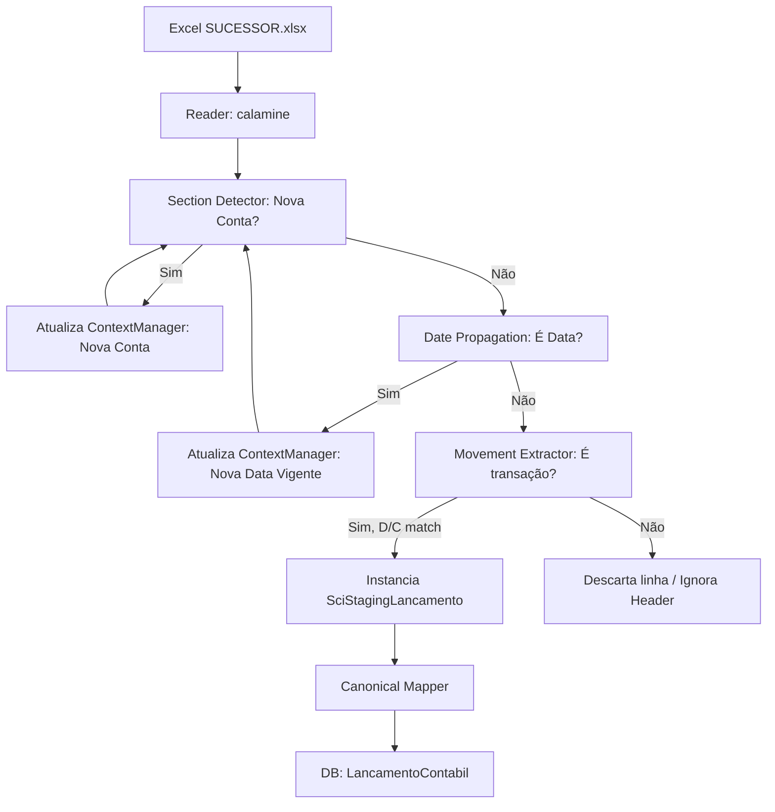

# Pipeline ETL: Razão Contábil SCI

Este documento detalha o componente `SciRazaoParser`, responsável por ler e interpretar o arquivo em formato não-tabular gerado pelo ERP SCI.

## 1. Fluxograma do Pipeline

O arquivo SCI possui relatórios mesclados. A quebra é lógica e exige um rastreamento de estado.

## 2. Arquitetura do Parser (Componentes)

1. **Reader**: Utilizamos `pandas` via `engine='calamine'` para contornar falhas de XML (Stylesheet issues) comuns nos exports do sistema SCI, preservando apenas os valores *raw*.
2. **ContextManager**: Guarda as variáveis voláteis (`current_account_code` e `current_date`). Evita a propagação excessiva de estados pelas funções.
3. **Patterns**: Todas as Regex foram centralizadas em `sci_patterns.py` (Ex: identificação monetária PT-BR, cabeçalho de contas, etc).

## 3. Regras de Parsing Implementadas

- **Date Propagation**: Datas não estão em cada linha de lançamento; elas aparecem soltas no excel (`01/06/2026`). O parser capta essa data e propaga para as transações seguintes.
- **Section Detachment**: Contas contábeis (ex: `85 - INTER - 01.1.1.02.004 Banco Inter`) abrem blocos lógicos. Todos os lançamentos abaixo herdam o ID da Conta Contábil vinculada.
- **D/C Floating Columns**: A extração dos valores varre o intervalo de colunas, pois o SCI mescla células, fazendo com que um Débito às vezes caia na coluna 10, às vezes na 12. O parser localiza pela máscara `CommonPatterns.MONETARY`.

## 4. Testes e Casos Reais Cobertos
Os testes automatizados (`test_sci_parser.py`) processaram 100% dos lançamentos contábeis reais do arquivo amostra:
- O Parser mapeia as Contas Contábeis virtualmente no Staging e faz um *Upsert* antes de criar as entidades filhas.
- Relacionamentos `LancamentoContabil` <-> `ContaContabil` preservados no Banco de Dados.

## 5. Limitações e Melhorias
- Atualmente o parser pula a descrição textual da conta (salvando-a provisoriamente como "Conta X"). Na próxima evolução, o Upsert da `ContaContabil` pode capturar e normalizar a descrição do Header (`match_conta.group(4)`).
- **Match Engine**: O campo `chave_origem_sci` extraído perfeitamente suportará a futura conciliação no motor da plataforma.
