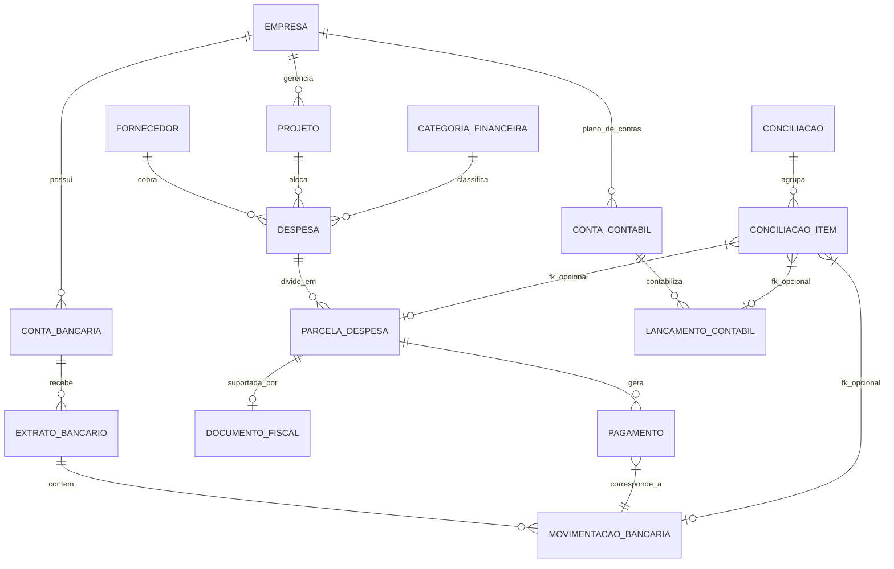

# Modelo Canônico - Plataforma de Conciliação Contábil

Este documento detalha o Modelo Canônico (Canonical Data Model) projetado para a Plataforma de Conciliação Contábil, separando os dados extraídos da Origem (Staging) e o modelo consolidado (Canonical).

## 1. Decisões Arquiteturais

1. **Separação de Camadas (Raw -> Staging -> Canonical)**: 
   - Arquivos originais não sofrem mutação (RAW).
   - O parser extrai exatamente o que está no arquivo (STAGING). Exemplo: `ImportacaoArquivo` rastreia a origem de todas as linhas.
   - O sistema normaliza para o Canonical Model. Aqui as despesas, lançamentos e movimentações de bancos diferentes falam o "mesmo idioma".
2. **Chaves Primárias e Auditoria**:
   - Todas as entidades utilizam `UUID` como chave primária interna (`id`).
   - Campos padrão em todas as tabelas: `created_at`, `updated_at`, `origem_sistema` (ex: "SCI", "INTER", "INTERNO") e `arquivo_origem` (UUID do arquivo importado).
3. **Preservação de Identificadores Externos**:
   - Para garantir a rastreabilidade e permitir idempotência nas reimportações, chaves nativas (ex: `codigo_cp` do Inter, `chave_origem_sci` do SCI) são mantidas em colunas específicas.
4. **Modelagem de Conciliação Tripartite (1:1, 1:N, N:1)**:
   - A conciliação ocorre unindo 3 pontas: Parcela Despesa, Movimentação Bancária, Lançamento Contábil.
   - Substituímos a abordagem polimórfica (MatchItem genérico) por uma abordagem **híbrida estruturada** (`ConciliacaoItem`) com chaves estrangeiras (FKs) opcionais para as três pontas. Isso garante **integridade referencial** no banco e facilita queries analíticas futuras.
5. **Entidade Pagamento**:
   - Criamos a entidade `Pagamento` entre `ParcelaDespesa` e `MovimentacaoBancaria` (N para 1) para suportar múltiplos pagamentos parciais, juros, descontos ou agrupamentos.

## 2. Diagrama ER (Textual)

## 3. Entidades e Campos Principais

### Campos de Auditoria Base (Presente em todas)
- `id` (UUID)
- `created_at` (DateTime)
- `updated_at` (DateTime)
- `origem_sistema` (String)
- `arquivo_origem` (UUID -> ImportacaoArquivo)

### Domínio Core
- **Empresa**: `cnpj`, `razao_social`, `nome_fantasia`
- **ContaBancaria**: `empresa_id`, `banco`, `agencia`, `conta`, `tipo`
- **ContaContabil**: `empresa_id`, `codigo_contabil`, `descricao`, `natureza`
- **Fornecedor**: `cnpj_cpf`, `nome`, `nome_normalizado`
- **Projeto**: `empresa_id`, `nome`, `codigo_externo`
- **CategoriaFinanceira**: `nome`

### Domínio Banco (Caixa)
- **ExtratoBancario**: `conta_bancaria_id`, `data_inicio`, `data_fim`, `saldo_inicial`, `saldo_final`
- **MovimentacaoBancaria**: `extrato_id`, `data`, `historico`, `descricao_original`, `valor`, `tipo` (D/C), `codigo_cp` (External ID), `linha_origem`

### Domínio Financeiro (Despesas e Pagamentos)
- **Despesa**: `fornecedor_id`, `projeto_id`, `categoria_id`, `valor_total`, `data_emissao`, `id_uuid_origem`
- **ParcelaDespesa**: `despesa_id`, `numero_parcela`, `valor`, `data_vencimento`, `data_pagamento_esperada`, `id_parcela_origem`
- **Pagamento**: `parcela_id`, `movimentacao_id`, `valor_pago`, `juros`, `desconto`, `data_pagamento`
- **DocumentoFiscal**: `parcela_id`, `numero_nf`, `chave_acesso`, `valor_nf`

### Domínio Contábil (Razão)
- **LancamentoContabil**: `conta_contabil_id`, `data`, `historico`, `valor`, `tipo` (D/C), `lote`, `chave_origem_sci`, `conta_contrapartida`

### Domínio Conciliação e Sistema
- **ImportacaoArquivo**: `nome_arquivo`, `tipo` (DESPESA, EXTRATO, RAZAO), `status`, `hash_arquivo`, `data_importacao`
- **Conciliacao**: `status` (PENDENTE, APROVADO, REJEITADO), `tipo_match` (1:1, 1:N, N:1, N:M), `score_match` (0 a 100), `regra_utilizada`, `aprovado_por`, `data_aprovacao`
- **ConciliacaoItem**: `conciliacao_id`, `parcela_id` (FK), `movimentacao_id` (FK), `lancamento_id` (FK)
